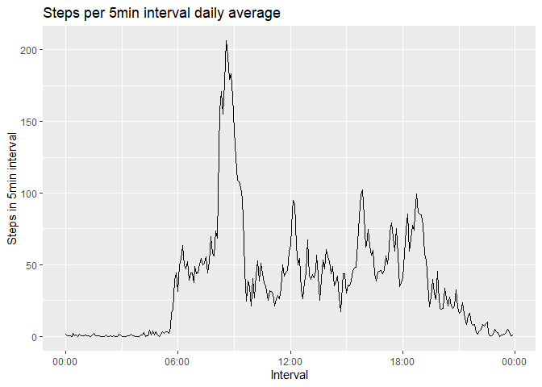
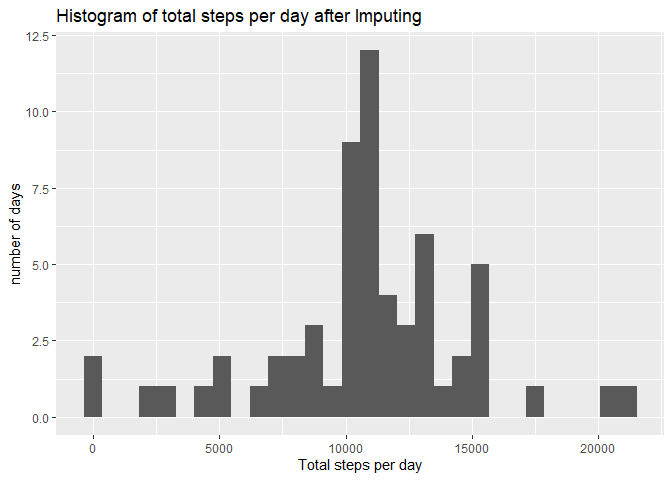
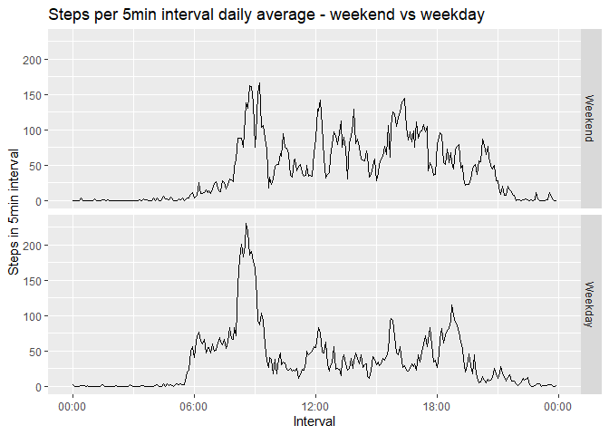

## Loading and preprocessing the data

``` r
data <- read.csv(file.path("activity", "activity.csv"))
data$date <- as.Date(data$date,"%Y-%m-%d")

# convert interval to hh:mm
library(hms)
convt <- function(x) {
        h <- as.integer(x/100)
        m <- x %% 100
        sprintf("%02d:%02d", h, m)
}
data$inv <- sapply(data$interval, convt)

# then convert to time class
data$inv <- as.POSIXct(parse_hm(data$inv))
```


## What is mean total number of steps taken per day?

``` r
library(dplyr)
```

```
## 
## Attaching package: 'dplyr'
```

```
## The following objects are masked from 'package:stats':
## 
##     filter, lag
```

```
## The following objects are masked from 'package:base':
## 
##     intersect, setdiff, setequal, union
```

``` r
library(ggplot2)

dayStep <- data %>% group_by(date) %>% summarize(ttlStep=sum(steps))
sumz <- summary(dayStep$ttlStep, na.rm=T)
paste("median =",sumz[3],",  mean =", sumz[4])
```

```
## [1] "median = 10765 ,  mean = 10766.1886792453"
```

``` r
ggplot(dayStep, aes(x=ttlStep)) +
        geom_histogram() +
        labs(title="Histogram of total steps per day", 
             x="Total steps per day",
             y="number of days")
```

```
## `stat_bin()` using `bins = 30`. Pick better value with `binwidth`.
```

```
## Warning: Removed 8 rows containing non-finite outside the scale range
## (`stat_bin()`).
```


## What is the average daily activity pattern?

``` r
library(lubridate)
```

```
## 
## Attaching package: 'lubridate'
```

```
## The following object is masked from 'package:hms':
## 
##     hms
```

```
## The following objects are masked from 'package:base':
## 
##     date, intersect, setdiff, union
```

``` r
invStep <- data %>% group_by(inv) %>% summarize(avgStep=mean(steps, na.rm=T))


ggplot(invStep, aes(x=inv, y=avgStep)) +
        geom_line() +
        scale_x_datetime(date_labels="%H:%M") +
        labs(title="Steps per 5min interval daily average",
             x="Interval",
             y="Steps in 5min interval")
```

<!-- -->

``` r
#which interval has max average steps per day
maxID <- which.max(invStep$avgStep)
timePoint <- format(invStep$inv[maxID], format="%H:%M")
paste("The interval with max number of steps is", timePoint)
```

```
## [1] "The interval with max number of steps is 08:35"
```


## Imputing missing values

``` r
# calculate the total number of rows with NAs
sumNA <- sum(is.na(data$steps))
paste("Number of NAs in original dataset =", sumNA)
```

```
## [1] "Number of NAs in original dataset = 2304"
```

``` r
# initiate
dataImp <- data
#for loop checking NA in every row. If missing, replace by daily mean of same interval.
for (i in 1:nrow(dataImp)) {
        if (is.na(dataImp$steps[i])) {
                dataImp$steps[i] <- as.integer(invStep$avgStep[which(invStep$inv==dataImp$inv[i])])
                }
        }
sumImp <- sum(is.na(dataImp$steps))
paste("Number of NAs after imputing =", sumImp)
```

```
## [1] "Number of NAs after imputing = 0"
```

``` r
# total number of steps each day
dayStepImp <- dataImp %>% group_by(date) %>% summarize(ttlStep=sum(steps))
sumzImp <- summary(dayStepImp$ttlStep, na.rm=T)
print(paste("median after impute =",sumzImp[3],",  mean after impute =", sumzImp[4]))
```

```
## [1] "median after impute = 10641 ,  mean after impute = 10749.7704918033"
```

``` r
ggplot(dayStepImp, aes(x=ttlStep)) +
        geom_histogram() +
        labs(title="Histogram of total steps per day after Imputing", 
             x="Total steps per day",
             y="number of days")
```

```
## `stat_bin()` using `bins = 30`. Pick better value with `binwidth`.
```

<!-- -->

As expected, using mean to impute NAs does not significantly change the mean and median values. However, the new histogram shows a much higher y value around the mean bin (x = ~10750). This is not surprising as NAs previously excluded are now replaced by means. This example demonstrates that methods of imputing can affect the distribution, for example, imputing to zero would decrease the mean and median values and elevate the x=0 bin height, and imputing to max would see opposite effects.


## Are there differences in activity patterns between weekdays and weekends?

``` r
dataImp$wkd <- factor(weekdays(dataImp$date) %in% c("Saturday", "Sunday"), 
                      levels = c(T,F), labels=c("Weekend","Weekday"))

weekendImp <- dataImp %>% filter(wkd==T) %>% group_by(inv) %>% summarize(avgStep=mean(steps, na.rm=T))

wdMeans <- dataImp %>% group_by(wkd,inv) %>% summarize(avgStep=mean(steps, na.rm=T))
```

```
## `summarise()` has grouped output by 'wkd'. You can override using the `.groups`
## argument.
```

``` r
ggplot(wdMeans, aes(x=inv, y=avgStep)) +
        geom_line() +
        facet_grid(wkd~.) +
        scale_x_datetime(date_labels="%H:%M") +
        labs(title="Steps per 5min interval daily average - weekend vs weekday",
             x="Interval",
             y="Steps in 5min interval")
```

<!-- -->

Clearly, weekday activites concentrate on the morning, with a major spike right before 9am. Weekend activities are dissipated across the entire daytime. 
